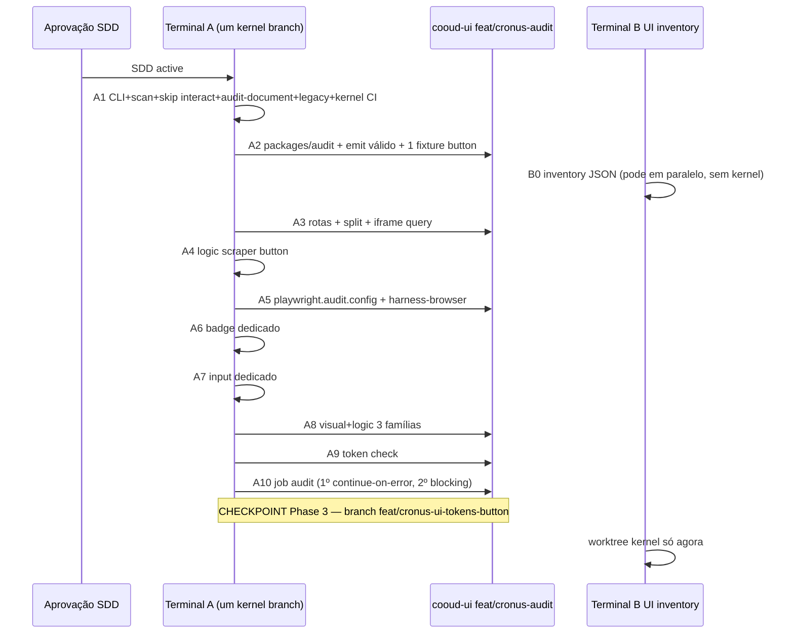

# SDD — Cronus Audit (`.Cronus Audit`) + port do catálogo cronus-ui → `.cronus`

**Status:** active
**Owner:** pedrogbraz
**Author:** pedrogbraz
**Created:** 2026-09-13
**Revised:** 2026-09-13 (review 8d2a32f7)
**Tier:** SYSTEM (multi-repo, multi-semana, duas frentes com gate)
**Repos (verificados 2026-09-13):**
- React SoT — `/Users/pedrogbraz/projects/cooud/cooud-ui` (`https://github.com/pedrogbraz/cronus-ui.git`, `main` @ `b5a3d1a3`)
- Kernel canônico — `/Users/pedrogbraz/projects/cooud/cronus-kernel` (`https://github.com/cronusmaster/cronus-kernel.git`, branch de integração **`feat/cronus-ui-tokens-button`** @ `2d49a38`)
- **Não usar** `/Users/pedrogbraz/projects/kronus/cronus-kernel` (checkout stale)
**Closes:** (TASK a abrir após aprovação; leases do daemon Kronus **não** se aplicam — K7)
**Nome do sistema:** **Cronus Audit** (feature `.Cronus Audit`). Distinto de `SDD-HARNESS-ENGINEER-V1.md` (fabrication rate do preflight no daemon).

---

## Overview

O catálogo visual que o parceiro construiu vive em React (`@cronus-ui/ui`, 212 famílias em `apps/www/lib/components-index.ts`). O kernel declara 173 nomes em `FAMILIES`, mas só `button` passa por renderer CONTRACT (`cronus_ui::button_ex`). O resto é stub (`pill` / `field` / `overlay` / `nav` / `display` / `chart` / `fx`) **ou** HTML nativo genérico em `cronus_ui_interact.rs`, que **intercepta badge e input antes** de qualquer match dedicado. O `cronus audit` atual compara texto contra HTML de referência — primitivo errado para paridade visual/lógica.

Duas frentes, com paralelização **estreita**:

1. **Cronus Audit** — três eixos (`language`, `visual`, `logic`) + cheat corpus. Dual preview no browser. Gate numérico. Sem isso, nenhum port é “idêntico”.
2. **Port do catálogo** — inventário JSON pode começar no dia 0 no worktree UI. Kernel de port e merge de paridade **só depois** do checkpoint Phase 3 na branch `feat/cronus-ui-tokens-button`.

---

## Background & Motivation

`.cronus` substitui HTML5 como **linguagem de autoria**. O compile target do browser continua HTML+CSS. Trapaça é o agente escrever/importar HTML/JSX/React (ou servir o docs React na pane “Cronus”) e declarar paridade.

O kernel **incentiva** a mentira: `FAMILIES.len() == 173` e `every_family_renders_slot_without_palette_scales` passa para caixas com `data-slot`. `cronus_ui_interact::render` ainda faz badge/input “existirem” como `<span>`/`<label><input>` genéricos — um teste que só compara com `fx()` **passaria hoje** sem renderer dedicado.

`SDD-HARNESS-ENGINEER-V1.md` (daemon, fabrication rate) **não** é este sistema.

Override do skill `cronus-senior-dev` (“NEVER touch `cronus-kernel/`”): o pedido do parceiro autoriza PRs pequenos no checkout **canônico**, sem stub novo, sem editar `src/server/router.rs` / `src/server/api.rs`. Ver K1.

---

## Goal (mensurável)

**North star:** um agente não declara paridade sem o harness passar; o harness falha se a origem for HTML/React/stub/interact genérico.

Gate v1 (harness “é real”):

| Critério | Número |
|---|---|
| Famílias `ported` (language + visual + logic) | **3:** `button`, `badge`, `input` |
| Stubs com fail obrigatório | **≥ 2:** `area-chart`, `meteors` |
| Cheat corpus | **12/12** (8 números source; cheat 4 = import **e** `page.config.source`; + 4 rota/estático) |
| Review humano | `/audit/button` split-view em `localhost:4747` (dev) |
| Pixel SoT | CI com `next start` + `cronus run --audit-canvas`; `maxDiffPixelRatio ≤ 0.02` no `[data-audit-canvas]` **dentro do iframe**; box do `data-slot` raiz ≤ **2 px** |
| Job CI `audit` | timeout **25 min** (build www + Rust/kernel + Playwright). Não é meta de 8 min. |

“Tudo portado” (212 componentes + 74 blocks + 25 templates) **não** é done do harness. Coverage sai de `bun run --filter @cronus-ui/audit inventory` (SPEC-014), não desta tabela de categorias.

---

## Current State

Evidência 2026-09-13. Adjetivos fora.

### Inventário React (cronus-ui / cooud-ui)

| Métrica | Valor | Fonte | Verdict |
|---|---|---|---|
| Git | `main` @ `b5a3d1a3` | `git` | SoT |
| `COMPONENT_COUNT` | **212** slugs | `ALL_COMPONENTS` | catálogo docs |
| `packages/ui/src/components/` | **409** ts/tsx; **213** sem `*.test.*` (212 docs + `motion-presets.ts`) | `find` | `motion-presets` não está em `CATEGORIES` |
| Testes de componente | **201** `*.test.*` sob `packages/ui/src` | `find` | irrelevante p/ Cronus |
| Categorias `CATEGORIES` (slug, não id) | `buttons` **9**, `forms` **30**, `data-display` **30**, `feedback` **7**, `overlays` **16**, `navigation` **12**, `date-time` **6**, `charts` **18**, `premium` **60**, `ai-elements` **23**, `preloaders` **1** = **212** | `components-index.ts` | breakdown anterior no SDD v0 estava errado |
| Charts engine | **182** arquivos em `packages/ui/src/charts/` | `find` | — |
| Blocks | **74** `BLOCK_FAMILY_BY_SLUG` = **74** `BLOCK_SLUGS`; **127** `id:` de variants | `blocks/registry.ts`, `blocks-index.ts` | — |
| Templates | **25** slugs; `customStage: true` (boolean) em `gontify` e `portfolio` | `templates/catalog.ts` | — |
| Previews vivos | `/components/[slug]`, `/blocks/[slug]`, `/preview/t/[slug]` | `apps/www/app/` | **zero** rota Cronus |
| Visual e2e | 15 `FULL_SET` + smoke 3×5 + `dialog open` = **31** PNGs darwin; `maxDiffPixelRatio: 0.02`; `use.viewport` global 1280×900 **mas** project `visual` espalha `devices["Desktop Chrome"]` (**1280×720**) | `e2e/visual`, `playwright.config.ts` | tripwire, não paridade; audit **não** copia Desktop Chrome |
| CI | `gates`, `browser` (timeout 40), `visual` (timeout 25, bootstrap linux) | `.github/workflows/ci.yml` | sem job de paridade; sem Rust |
| `pixelmatch` / SSIM / `dependency-cruiser` | **0** no lockfile / configs | grep | Playwright nativo; cheat 10 = **file test**, não depcruiser |
| Pasta `features/` | não existe | layout | `packages/*` |
| Linhas do monorepo | DS `tokens → theme → ui → www`; tooling `ai-kit → cli → create-*`; **não cruzar** — terceiro lugar se precisar | `AGENTS.md` | harness = **terceira linha** (K18) |
| Contrato | `CONTRACT.md`: tokens, CVA, `data-slot` no root, focus ring, RTL. **Não exige `data-size`.** | raiz | — |
| Button DOM | `data-slot="button"` + `data-variant`; **sem `data-size`** | `button.tsx:50-51` | kernel hoje emite `data-size` extra |
| Badge DOM | `<span data-slot="badge" data-variant>` | `badge.tsx` | default variant `"default"` |
| Input DOM | `<input data-slot="input" aria-invalid>` **sem wrapper**, `h-10 w-full` | `input.tsx` | interact hoje é `<label data-slot="input"><input data-slot="input-control">` |
| Temas | 5 presets × 2 modes | `packages/tokens/src/tokens.ts` | — |
| Root layout www | `lang="en"`, default **neutral/dark**, skip-link, `CronusUIProvider asRoot` | `apps/www/app/layout.tsx` | canvas React tem de **overridar** tema no canvas, não no `<html>` só |
| `"audit"` script raiz | `bun audit` (npm CVE) | `package.json` | rename → `security:audit` |
| Zod | override `^4.4.3` | `package.json` | schema de fixture |
| Playwright exige | `bun run build` + `next start` | `AGENTS.md` | pixel SoT ≠ `next dev` |

### Inventário kernel (canônico)

| Métrica | Valor | Fonte | Verdict |
|---|---|---|---|
| Git | `feat/cronus-ui-tokens-button` @ `2d49a38` | `git` | **branch de integração** até Phase 3 (não assumir `main`) |
| Crate | bin único; sem `[lib]` | `Cargo.toml` | — |
| `#[test]` | **245** (AGENTS.md diz 203 — stale) | `rg` | — |
| CI kernel | **não há** `.github/workflows` | ls | PRs hoje são gate local; A1 adiciona `cargo test` workflow |
| `FAMILIES` | **173** | `cronus_ui_widgets.rs` | catálogo falso |
| Dispatch CONTRACT | **1** (`"button" => button_from`) | match | único que **não** passa pelo interact |
| Stubs no match | `fx` **41**, `display` 33, `field` 24, `chart` 20, `pill` 19, `nav` 18, `overlay` 17 | `=> fn(` | — |
| Interact | **112** famílias kebab únicas no `match family`; chamado **antes** do match widgets | `cronus_ui_interact.rs` | badge=`pill`, input=`<input>` genérico |
| Fora do interact | ≈ **61** (charts + fx + `button`) | 173−112 | só button é dedicado |
| React ausente no kernel | **41** slugs | diff | — |
| Kernel extras | `motion-presets`, `toast` | diff | — |
| Tokens | `cronus_ui_tokens.css` **41146** bytes | fs | drift |
| `COMPONENT_CHROME` | já contém `[data-slot="badge"]` e `[data-slot="input"]` CSS | `cronus_ui.rs` | CSS ≠ renderer |
| `cronus audit` | texto vs HTML, 527 LOC | `audit_fidelity.rs` | primitivo errado |
| Help | lista `verify-audit`, **não** `audit` | `help.rs` | — |
| Dump | `template "<html>"`, `stack react + tailwind` | `dump/emit.rs` | cheat institucionalizado |
| Widget authoring que funciona | top-level `component Save …` + `page { use Save }` | `demos/cronus-ui/button.cronus` | `component` **dentro** de `page` vira section PascalCase, **não** dispara `FAMILIES` |
| `render_layout` | `data-cronus-mode="dark"` hardcoded, `lang="pt-BR"`, `<main min-height:100vh; max-width:1120px>` + Tailwind + animations CSS/JS + HMR | `ui/layout.rs:10-16` | **inútil** para canvas 480px / light / `lang=en` |
| `render_layout_landing_ex` | honra light/dark | `layout.rs:517` | não é o path de `type:custom` widget |
| `cronus run` theme | um `style { preset; theme }` por processo; **sem** query string | — | v1 precisa de audit-mode por request (K14) |
| Voodoo | opt-in CDN `voodoojs@0.13.0` | `voodoo.rs` | off na paridade |
| Port default | 5175 | doctor/templates | fixtures usam **5176** |
| HTTP `/api/audit/*` | **vivo** em `src/main.rs` (`trigger`, `results`, `trail`) — dump-fidelity no browser, **não** Cronus Audit | `main.rs:660+` | não colide com pages `/audit/...` (sem `/api`) |
| `page.config.source` | `handle_request_inner` **lê o arquivo e devolve HTML cru** **antes** de layout | `main.rs:1392-1396` | cheat: `source "./stolen.html"` sem `<` no `.cronus` |
| Dead `/api/audit/*` | `server/router.rs` não compila | AGENTS.md | ignorar |
| `src/audit.rs` | hash-chain DB | — | **não** renomear |
| `cronus-browser/` | WebKitGTK MITM | kronus | não é renderer |
| `scraper` | já no `Cargo.toml` | — | logic_parity |

### A mentira em código

```541:546:/Users/pedrogbraz/projects/cooud/cronus-kernel/src/cronus_ui_widgets.rs
fn fx(family: &str, comp: &ComponentNode) -> String {
    let title = label_of(comp);
    format!(
        "<div data-slot=\"{family}\" style=\"{BASE}{SURF}padding:0.75rem 1rem;position:relative;overflow:hidden;\"><span>{title}</span></div>"
    )
}
```

Dispatch atual:

```184:192:/Users/pedrogbraz/projects/cooud/cronus-kernel/src/cronus_ui_widgets.rs
pub fn render(comp: &ComponentNode) -> Option<String> {
    let family = style.split('+').next()...
    if let Some(html) = crate::cronus_ui_interact::render(family, comp) {
        return Some(html); // badge e input morrem aqui
    }
```

`every_family_renders_slot_without_palette_scales` certifica o stub.

### Root causes

1. Catálogo ≠ renderer (`FAMILIES` + generator).
2. Interact genérico **mascara** famílias que o SDD v0 queria “portar” só adicionando um arm depois.
3. Audit mede dump-texto, não pixels.
4. `template` HTML no AST.
5. `render_layout` não é canvas isolado (1120px, dark hardcoded, `lang=pt-BR`, JS de animação/HMR).
6. Dois checkouts de kernel.
7. **Early return `page.config.source`** (`main.rs:1392`) serve bytes de um HTML externo. Audit-mode que só “embrulha” o dispatcher existente **perde**.

---

## Target State

| Métrica | Current | Target harness v1 | Catálogo (pós-waves) | Como |
|---|---|---|---|---|
| `ported` | 0 | **3** | 212 + 74 + 25 via inventory | `cronus audit` + Playwright audit config |
| Stubs no allowlist | ~172 de facto | **0** | 0 | SPEC-002 + skip interact |
| Cheat | possível | **12/12** | 12/12 | 8 `.cronus` + 4 rota |
| Dual preview | 0 | `/audit/button` | slugs ported | SPEC-006 |
| Theme/mode Cronus | 1 por processo, dark hardcoded | `?preset=&mode=` por request em audit-mode | idem | K14 |
| Canvas Cronus | `<main> 1120px` | `[data-audit-canvas]` 480px injetado pelo binário | idem | K12 |
| Job `audit` | n/a | timeout 25 min, blocking no 2º PR do job | split por wave | SPEC-012 |
| Kernel CI | nenhum | `cargo test` workflow | idem | A1 |

---

## Goals & Non-Goals

### Goals

- Três eixos + cheat corpus + stub/interact gate.
- Dual preview; harness engineer no browser **e** pixel SoT em `next start`.
- Slice: 3 pass + ≥2 fail stub.
- Inventário UI no dia 0; kernel de port só após Phase 3 na branch nomeada.

### Non-Goals (v1)

- Browser próprio / Servo / `cronus-browser` como renderer.
- Portar 212 famílias no trem do harness.
- Cronus Pro `:4748` no dual preview.
- Motion/WebGL na wave 1; `focus-visible` no **pixel** v1 (fica no eixo logic).
- Reescrever `cronus dump`.
- Publicar `@cronus-ui/audit` no npm.
- Daemon fabrication-rate.
- `[lib]` no kernel.
- Mock Chromium; adicionar `pixelmatch`/`dependency-cruiser`.
- Colocar harness em `packages/ui` **ou** na linha `ai-kit → cli`.
- Segunda branch kernel / worktree kernel B antes do checkpoint.
- `data-size` no React Button (não é CONTRACT hoje; não abrir ADR no v1).

---

## Proposed Design

### A fronteira que o agente não fura

O kernel **pode** emitir HTML+CSS no **output**. Cronus Audit falha se a **origem** não for: AST `.cronus` limpo + renderer Rust **dedicado** (não interact genérico, não `fx`/`chart`/…) + tokens vendored + **neste processo** `cronus` iniciado pelo Playwright/`audit:dev`.

Não é prova: screenshot 100% igual; `data-slot` presente; HTML servido em `:5176` por um static server **ou** por `page.config.source` → `fs::read_to_string` (`main.rs:1392`); `include_str`/`fs::read` de `.html`; iframe do docs React; `srcdoc`; `stack react`/`voodoo`; wrapper `data-audit-canvas` escrito no `.cronus`; header `X-Cronus-Engine` em **todas** as respostas do processo.

Audit-mode (K12) **não** é um wrap no fim de `handle_request_inner`. É um **path HTTP exclusivo** (K21). Language scan **não** vê o canvas injetado no source — e **falha** se o `.cronus` declarar HTML **ou** `source "./….html"`.

### Audit-mode do kernel (K12 + K14 + K21)

`cronus run --audit-canvas 5176` (env equivalente `CRONUS_AUDIT=1`). Bind **só** `127.0.0.1` (nunca `0.0.0.0`).

**Path HTTP único** — early return **antes** do dispatcher de páginas de `handle_request_inner` (`src/main.rs` ~1362+). Função nova `handle_audit_request` (`src/cli/audit_http.rs`). Não há fallthrough.

```
if audit_canvas && path.starts_with("/audit/") {
    return handle_audit_request(req, state); // sem handle_request_inner
}
if audit_canvas {
    return 404; // nenhuma outra rota, inclusive /api/audit/*, HMR, landing, source HTML
}
```

Passos de `handle_audit_request` (ordem obrigatória):

1. Path = `req.uri().path()` (query **não** entra no match — já é assim em `main.rs:341`). Query parse: `preset` / `mode` / `dir`. Default `aurora` / `dark` / `ltr`. Valores fora do enum → 400.
2. Lookup da `page` com `route == path`. Se não existe → 404, **sem** body de arquivo.
3. **Recusar** (404, body curto texto, **sem** ler disco): `page.config.get("source")`, qualquer `section.template` / `style_block`, `page.config.layout == light-app`, heurísticas login/signup/order-detail/settings, `has_templates`. **Nunca** `std::fs::read_to_string` neste path.
4. Resolver `page.components` (`use Nome`) → `state.components` → `cronus_ui_widgets::render` (K13: skip interact se ported). v1: exatamente **um** component resolvido; 0 ou N>1 → 400.
5. HTML do widget entra **só** em `render_audit_document` (`src/ui/audit_layout.rs`):
   - `<html lang="en" data-cronus-theme="{preset}" data-cronus-mode="{mode}">`
   - tokens: CSS vendored completo (seletores `[data-cronus-theme][data-cronus-mode="light"]`). **Não** depender de `token_css` honrar o param `mode` (`cronus_ui.rs` hoje faz `let _ = mode`).
   - **zero JS** v1 (sem `render.rs`, HMR, `CRONUS_ANIMATIONS_JS`). Denylist permanente se wave 2 allowlist snippet: `innerHTML`, `srcdoc`, `fetch(` para `:4747` / `aicronus.com`, `React`, `createElement`.
   - Body = um `[data-audit-canvas]` (width **480px**, min-height 240px, padding 24px, `box-sizing: border-box`, `dir` do query, background `var(--cronus-surface-base)`) em volta do widget.
6. Headers **somente nesta resposta 200**: `X-Cronus-Engine: cronus-lang/0.1.0`, `X-Cronus-Audit: 1`, `Content-Type: text/html; charset=utf-8`. 404/400 **não** levam `X-Cronus-Audit` (Playwright do happy path exige o header; o cheat path não pode “passar de header”).

**Proibido neste path:** `page.config.source`, `section.template`, `render_layout` / `render_layout_declarative` / `render_layout_landing_ex`, `render_page`, `render_auth_page`, `render_light_app_page`, `render_order_detail_dashboard`, `render_settings_dashboard`, `html_response` genérico, `/.cronus/version` HMR, bind `0.0.0.0`.

Isso é HTML de compile target, não autoria. Um teste kernel `audit_http_ignores_page_source` coloca `stolen.html` no cwd, page com `source "./stolen.html"` + `use ButtonPrimaryMd`, GET `/audit/button/primary-md` → **404**, body **não** contém o conteúdo de `stolen.html`.

### Dispatch: skip interact para `PORTED_FAMILIES` (K13)

```rust
pub fn render(comp: &ComponentNode) -> Option<String> {
    let family = family_of(comp)?;
    if PORTED_FAMILIES.contains(&family) {
        return dedicated_render(family, comp); // only path cronus run uses
    }
    if let Some(html) = cronus_ui_interact::render(family, comp) {
        return Some(html); // demos não-auditados
    }
    generic_stub_match(family, comp)
}

fn dedicated_render(family: &str, comp: &ComponentNode) -> Option<String> {
    match family {
        "button" => Some(button_from(comp)),
        "badge" => Some(crate::cronus_ui_badge::render(comp)),
        "input" => Some(crate::cronus_ui_input::render(comp)),
        _ => None, // allowlist sem arm = compile/test fail
    }
}
```

`RendererKind` ao lado de `PORTED_FAMILIES` (teste que o arm chama a função nomeada, **não** heurística de HTML vs `fx()`):

```rust
pub enum RendererKind { Dedicated(&'static str), Interact, Stub(&'static str), Missing }
```

Gate `ported` = allowlist ∧ `RendererKind::Dedicated` ∧ HTML vivo ≠ fingerprint interact (`label+input-control`, inline `CTRL`/`BASE`/`SURF`, `pill(`) ∧ ≠ fingerprints `pill|field|overlay|nav|display|chart|fx` ∧ fixtures pass ∧ language pass.

Testes:

- `ported_family_skips_interact` — `cronus_ui_interact::render("badge", …)` pode ser `Some` (código legado), mas `widgets::render` de um `style:badge+…` **não** é o HTML do interact.
- `ported_family_does_not_use_interact_generic` — fail se o HTML vivo contém `data-slot="input-control"` ou o template `CTRL` do interact.
- `no_new_stub_families` — `FAMILIES` novo sem `Dedicated` quebra CI.
- `dedicated_module_no_sidecar_assets` — `rg` em `cronus_ui_{family}.rs` + `cronus_ui.rs` proíbe `include_str!` / `fs::read` de qualquer não-`.rs` exceto `cronus_ui_tokens.css`.

**CSS chrome (cheat 11, explícito):** v1 **pode e deve** estender `COMPONENT_CHROME` em `cronus_ui.rs` com regras `[data-slot="badge"]` / `[data-slot="input"]` usando **somente** `var(--cronus-*)` (já há esboço). Isso é o port de CVA→CSS, igual ao Button. Proibido: `--tw-`, `zinc-`, `@tailwind`, copiar stylesheet compilado do www. Extração por módulo é Phase 4+, não v1.

### Authoring `.cronus` das fixtures (Issue 6)

`emit-cronus-fixture.ts` emite o shape que o parser **já** aceita (`demos/cronus-ui/button.cronus`). Um único `app.cronus` ( `find_all_cronus_files()` concatena todo `*.cronus` do cwd):

```cronus
app "audit-fixtures" {
  port 5176
}

style {
  preset aurora
  theme dark
}

component ButtonPrimaryMd layout:inline style:button+primary+md {
  label "Save profile"
}

page "/audit/button/primary-md" type:custom {
  use ButtonPrimaryMd
}
```

Nomes de `component` **únicos** por fixture (`ButtonPrimaryMd`, `BadgeDefault`, `InputEmpty`). Sem `component` aninhado em `page`. Sem `stack react` / `voodoo` / `template` / `style_block` / **`source`**. Theme/mode reais da foto vêm da **query** audit-mode, não deste `style` global (o bloco `style` permanece como fallback).

### Visual parity

Canvas idêntico nos dois lados (React no TSX; Cronus **injetado pelo binário**):

```
[data-audit-canvas]
  dir / data-cronus-theme / data-cronus-mode
  width: 480px; min-height: 240px; padding: 24px;
  background: var(--cronus-surface-base);
  → [data-slot={family}]
```

Input é `w-full` / `width:100%`: o containing block **tem** de ser 480px dos dois lados, senão δ de dezenas de px.

Playwright fotografa **dentro** do iframe Cronus:

```ts
const frame = page.frameLocator('[data-audit-side="cronus"] iframe');
await expect(frame.locator("[data-audit-canvas]")).toHaveScreenshot(...);
```

`FREEZE_CSS` aplicado **dentro do frame** (CDP / `frame.locator` + `addStyleTag` no frame), não no parent. Hover: `frame.locator("[data-slot=button]").hover()`.

**Métricas visuais v1:**

1. Pixel: `toHaveScreenshot`, `animations: "disabled"`, `deviceScaleFactor: 1`, `--force-color-profile=srgb`, viewport **explícito `{ width: 1280, height: 900 }`** no project audit — **não** `...devices["Desktop Chrome"]` (720p). `maxDiffPixelRatio: 0.02`. Baselines por `{platform}`.
2. Box do `[data-slot]` raiz: |Δ| ≤ 2px em x/y/w/h. Parse `getBoundingClientRect`.
3. Computed style: `backgroundColor`, `color`, `height`, `fontSize`, `fontWeight`, `borderRadius`, `opacity`. **Não** comparar `boxShadow` string no v1. Cores: `getComputedStyle` devolve `rgb()`/`rgba()` — um único helper `cssColorToHex` (alpha: `rgba(0,0,0,0)` → transparente tratado como fail se o outro lado for opaco; senão hex 8 dígitos). Comparar hex canônico, não a string crua.

**Estados visuais v1:**

| Estado | Button | Badge | Input |
|---|---|---|---|
| `default` aurora/dark, aurora/light, neutral/dark | sim | sim | sim |
| `hover` aurora/dark | sim (dentro do iframe) | — | — |
| `disabled` aurora/dark | sim | — | sim |
| `invalid` aurora/dark | — | — | sim (`aria-invalid`) |
| `rtl` aurora/dark | sim | sim | sim |
| `as-link` | **logic + visual** aurora/dark | — | — |
| `focus-visible` | **só logic** (ring presente ≠ none) | só logic | só logic |

`focus-visible` fora do pixel v1: React usa `ring-2 ring-offset-2` (box-shadow); kernel `FALLBACK_ROOT` usa `outline: 2px`. Alinhar o chrome do Button ao CONTRACT (SPEC-013) é desejável, mas **não** é gate visual do slice — evita flake >2% / >2px. Overlay open fora do v1.

~20 PNGs/plataforma (não 25 com focus). Job inteiro ≤ 25 min, não 8.

### Logic parity (K15 — contrato React **como está**)

Mesma fixture JSON. Comparar o que o React **já emite**, não um contrato inventado.

| Check | React real | Cronus | Passa se |
|---|---|---|---|
| `data-slot` raiz | obrigatório CONTRACT | dedicado | igual a `slots.root` |
| `data-variant` | Button e Badge **sim**; Input **não** | só se React tiver | se `expect.attrs` listar; **não** exigir `data-size` |
| `data-size` | Button **não emite** | `button_ex` hoje emite | **ignorado** no compare v1. Kernel pode continuar emitindo. **Não** mudar `button.tsx` no v1 |
| tag / role | Button `<button>` / asChild `<a>`; Badge `<span>`; Input **`<input data-slot="input">` sem label wrapper** | igual | Input dedicado **não** pode ser interact (`<label>…<input data-slot="input-control">`) |
| `aria-invalid` | Input | Input | igual quando fixture `invalid` |
| `disabled` | click 0 | attr + pointer-events | 0 dos dois lados |
| `href` | `renderReactFixture`: se `props.href`, `<Button asChild><a href={…}>` | `href` → `<a>` | ambos `role=link`, mesmo href |
| teclado | Enter/Space; Tab → focus ring **existe** (computed outline ou box-shadow ≠ `none`) | nativo | logic only |
| tokens | computed hex via helper | `var(--cronus-*)` | hex igual |

Schema: `expect.attrs` só chaves que o React emite. Comentário no schema: `data-size` não é CONTRACT.

### Cheat detection

Dois scanners (Rust + TS) rodam o **mesmo** corpus `packages/audit/fixtures/_cheats/*.cronus` no CI (byte-compare da lista de códigos de erro). Rotas não entram nesse diretório.

**Corpus 12/12:**

| # | Caso | Tipo | Detecção |
|---|---|---|---|
| 1 | Tags HTML no `.cronus` | source | `<[a-zA-Z]` no raw **ou** em **qualquer** campo de conteúdo: `label`, `text`, `title`, `subtitle`, `value`, `help`, placeholder, `template`. Exceção: nenhum. `label "<div>"` fail. `label "Save <draft>"` fail (casa `^<`? — política: fail se o valor **casa** `^<[a-zA-Z]` **ou** contém `<[a-zA-Z]`). Texto `2 < 3` sem letra após `<` passa. |
| 2 | JSX/TSX | source | `className=`, `</[A-Z]`, `<>` |
| 3 | `template` / `style_block` | source/AST | `Some` + HTML/CSS |
| 4 | Sidecar não-`.cronus`: `import` `.html/.tsx/.jsx/.css` **ou** `source "./stolen.html"` / `page.config.source` | source | extensão no `ImportNode`; chave `source` na page (AST `page.config`) mesmo sem `<` no arquivo. Código `CRONUS_AUDIT_SIDECAR_SOURCE`. Dois fixtures: `04-import-tsx.cronus`, `04-page-source-html.cronus` |
| 5 | sidecar no renderer | kernel rg | `include_str!` / `fs::read` / `read_to_string` de não-tokens |
| 6 | React dump / `dangerouslySetInnerHTML` na rota Cronus | **rota** | file test + Playwright |
| 7 | iframe `/components/` na pane Cronus | **rota** | Playwright |
| 8 | `srcdoc` na pane Cronus (inclui copiar HTML do pane React) | **rota** | Playwright; teste que injeta srcdoc e **exige fail** |
| 9 | `stack react` / `stack voodoo` | source | AST stack |
| 10 | `from "@cronus-ui/ui"` em `preview/cronus/**` | **estático** | teste de arquivo (ler sources). **Não** dependency-cruiser |
| 11 | CSS `--tw-` / `zinc-` / `@tailwind` fora de tokens | source + kernel chrome | allowlist tokens.css + `COMPONENT_CHROME` sem essas substrings |
| 12 | Voodoo na fixture de paridade | source + output | `v-data` / `v-model` / runtime script. **Não** flagrar `{` de `style { }` — só attrs Voodoo e `voodoojs@` no HTML de audit-mode (que deve ter JS=0) |

SPEC-001 aceita os **8 números** source (1–5, 9, 11–12); o nº 4 tem **dois** fixtures (import + `page.config.source`). SPEC-017 = 12/12. Audit-mode: fixture `04-page-source-html` → language fail **e** GET `/audit/…` **404** (nunca 200 com bytes do arquivo), mesmo se o scan for pulado.

Proveniência `:5176`: `playwright.audit.config.ts` `reuseExistingServer: false` **sempre** (CI e local do job). Header `X-Cronus-Engine` obrigatório. `CRONUS_AUDIT_ORIGIN` parsed URL: scheme `http:` **e** hostname **exato** `127.0.0.1` ou `localhost` (não `includes("localhost")`).

### Dual preview

| Rota | Papel |
|---|---|
| `/audit/[slug]` | split; toolbar escreve searchParams (`fixture`, `preset`, `mode`, `dir`) — React re-render no canvas; Cronus iframe `src` **recarrega** com a mesma query (não há hot theme sem reload no kernel — o “sem full reload” aplica-se só ao shell React) |
| `/preview/react/[slug]/[fixture]` | canvas React; tema no **canvas** (`data-cronus-theme` no wrapper), não depender do `<html>` neutral/dark do root layout. Layout de preview: sem `SiteNav`; skip-link pode ficar |
| `/preview/cronus/[slug]/[fixture]` | só `<iframe sandbox="allow-scripts" src="{origin}/audit/{slug}/{fixture}?preset=&mode=&dir=">` (sem `allow-same-origin` no v1 — parent não lê DOM; Playwright usa CDP no frame). Sem srcdoc. Sem import UI. Host check no server component |

`sandbox` sem `allow-same-origin`: swipe/diff no parent é CSS (clip das panes), não leitura do DOM Cronus. Native `<dialog>` não está no slice v1.

Empty state se origin down. `robots: noindex`. Fora de localhost origin → empty (não 503 com stack).

Script humano: `bun run audit:dev` em `packages/audit` (ou raiz) sobe `next dev :4747` **para UX** + `cronus run --audit-canvas 5176`. Pixel SoT **não** usa esse script — usa `playwright.audit.config.ts` (`next start` + kernel, `reuseExistingServer: false`).

### Terceira linha (K18)

Não é tooling `ai-kit → cli`. Não é DS `tokens → ui`.

```
packages/audit  →  @cronus-ui/ui, @cronus-ui/tokens
apps/www        →  @cronus-ui/audit   (rotas /audit, /preview/*)
packages/cli, create-*, ai-kit  ↛  audit
packages/ui     ↛  audit
```

UI do split: `apps/www/components/audit/*` apenas.

`packages/audit/package.json`: `"name": "@cronus-ui/audit"`, `"scripts": { "build": "tsc -p tsconfig.json", "test": "vitest run", "cli": "bun src/cli.ts", "inventory": "bun src/catalog-inventory.ts" }`. `turbo.json` `^build` exige `build` (tsc). Workspace. `transpilePackages` += `"@cronus-ui/audit"`.

### Paralelo / git (K16)

**Um** branch kernel até Phase 3: `feat/cronus-ui-tokens-button`. Todo PR A de kernel aponta para ele (Button+tokens já estão lá; merge para `main` do kernel **não** é o gate de B — B rebaseia nessa branch).

| Quando | UI | Kernel |
|---|---|---|
| Dia 0 | worktree `feat/cronus-audit` (harness) **e** opcional `feat/cronus-port-catalog` só para inventory JSON | **um** worktree A em `feat/cronus-ui-tokens-button` |
| Phases 1–3 | A implementa harness | A: CLI, dispatch skip, `handle_audit_request` (bypass `source`), badge, input |
| Após Phase 3 no branch | B fixtures por família | B abre worktree kernel **a partir desse SHA** |

Não criar worktree kernel B no dia 0. Inventory não precisa do kernel.

Gate www: job clona `cronusmaster/cronus-kernel` no `CRONUS_KERNEL_REF` (SHA). Bump de SHA = commit no PR ui. **Não** usar `Depends-On:` cross-org. Se o clone público falhar (repo privado), secret opcional `CRONUS_KERNEL_CLONE_TOKEN`.

Kernel CI novo: `.github/workflows/test.yml` (`dtolnay/rust-toolchain`, `Swatinem/rust-cache`, `cargo test`). Até isso mergear, PR template exige log de `cargo test` local.

### Waves (contagens reais de `CATEGORIES`)

Slice v1 já tirou `button` (buttons), `input` (forms), `badge` (data-display).

| Wave | Conteúdo | Count | Notas |
|---|---|---|---|
| 0 harness | button, badge, input + fail area-chart, meteors | 3 pass | Terminal A |
| 1 primitivos | buttons 8 + forms 29 + data-display 29 + feedback 7 | **73** | não ~54 |
| 2 | overlays 16 + navigation 12 + date-time 6 | **34** | dialog open entra aqui |
| 3 | charts | **18** | sem polyline |
| 4a/4b | premium | **60** | 4b globe/number-flow/canvas |
| 5 | ai-elements 23 + preloaders 1 | **24** | |
| 6 | blocks | **74** | filhos têm de ser `ported` |
| 7 | templates | **25** | `customStage` por último |

Inventory (SPEC-014) é SoT daqui pra frente. Esta tabela é planejamento, não o número do CI.

---

## API / Interface Changes

### CLI

```
cronus run --audit-canvas [port]          # 5176; query preset/mode/dir
cronus audit language --source <file>
cronus audit logic    --source <file> --fixture <json>
cronus audit visual                       # exit 2: use Playwright cooud-ui
cronus audit all      --source <file> --against react --fixture-dir <dir>
cronus audit legacy   <reference.html> [--threshold 95]
```

Se `args[2]` existe como arquivo e termina em `.html` → `legacy` (**alias permanente**, K20).

Exit: 0 pass, 1 paridade/cheat/stub, 2 uso/infra.

Headers de `cronus run --audit-canvas` documentados acima.

### `@cronus-ui/audit`

```ts
export { ParityFixtureSchema, type ParityFixture } from "./parity-fixture.js";
export { listFixtures, getFixture } from "./fixture-catalog.js";
export { renderReactFixture } from "./react-fixture-render.js";
export { emitCronusPage, emitCronusApp } from "./emit-cronus-fixture.js";
export { scanSourceLanguage } from "./source-language-scan.js";
export { compareLayoutBox } from "./layout-box.js";
export { cssColorToHex } from "./css-color-to-hex.js";
export { formatAuditReport, type AuditReport } from "./audit-report.js";
export { reactPreviewPath, cronusPreviewPath, auditPagePath } from "./dual-preview-url.js";
```

`emitCronusApp` gera o `app.cronus` único com N `component` + N `page { use }`.

### Rotas www

`GET /audit/[slug]`, `/preview/react/[slug]/[fixture]`, `/preview/cronus/[slug]/[fixture]` — sem auth; noindex; origin allowlist.

---

## Data Model Changes

Sem DB.

```
packages/audit/package.json
packages/audit/tsconfig.json
packages/audit/src/cli.ts
packages/audit/fixtures/{family}/{id}.json
packages/audit/fixtures/_cheats/{01-html-in-source,…}.cronus   # 8 files
packages/audit/cronus-fixtures/app.cronus   # gerado no CI
e2e/audit/__screenshots__/{platform}/…
playwright.audit.config.ts
```

Tokens: runtime layer check (não o arquivo Tailwind `@theme` inteiro).

---

## Specs

### SPEC-001 — Language scan (8 números source; cheat 4 inclui `page.config.source`)

**Problem:** HTML/JSX/`template`/`stack react` no source; **e** `source "./stolen.html"` no page (sem `<` no `.cronus`) que `handle_request_inner` serve como HTML cru (`main.rs:1392`).
**Change:** `source_language_scan.rs` + TS; denylist em **todos** os campos de conteúdo; Voodoo sem false-positive em `style {`; chave `source` na page / `import` não-`.cronus` → `CRONUS_AUDIT_SIDECAR_SOURCE`.
**Acceptance:** 8 números fail com códigos estáveis (cheat 4: **dois** fixtures, ambos fail). Fixture limpa do slice passa. CI compara output Rust vs TS. Playwright/`cargo test`: `04-page-source-html.cronus` + arquivo `stolen.html` no cwd → `cronus audit language` ≠ 0 **e** `GET /audit/button/primary-md` em `--audit-canvas` = **404**, body ≠ conteúdo de `stolen.html`.
**Files:** `cronus-kernel/src/cli/source_language_scan.rs`, `packages/audit/src/source-language-scan.ts`, `packages/audit/src/source-language-scan.test.ts`, `fixtures/_cheats/04-import-tsx.cronus`, `fixtures/_cheats/04-page-source-html.cronus`

### SPEC-002 — Stub + skip interact + `RendererKind`

**Problem:** interact intercepta badge/input; teste vs `fx()` passaria hoje.
**Change:** `PORTED_FAMILIES`; skip interact; `dedicated_render`; testes listados em K13; generator não cria stub; rg sidecar.
**Acceptance:** `style:input` em audit-mode **não** contém `input-control`. `style:area-chart` → `CRONUS_AUDIT_STUB_RENDERER`. `style:button+primary+md` → `RendererKind::Dedicated("button_from")`.
**Files:** `cronus_ui_widgets.rs`, `stub_renderer_gate.rs`, `gen_cronus_ui_widgets.py`, testes no módulo

### SPEC-003 — Fixture schema + emit válido

**Problem:** vibe; emit aninhado não parseia.
**Change:** Zod; `emitCronusApp` snapshot = `component X` + `page { use X }`, nomes únicos.
**Acceptance:** `cronus parse` no `app.cronus` gerado = 0 erro; AST tem `AstNode::Component` + `use` na page, não `section_type: "Button"`; **nenhuma** page com `config.source`.
**Files:** `parity-fixture.ts`, `emit-cronus-fixture.ts`, `fixture-catalog.ts`

### SPEC-004 — Preview React isolado

**Problem:** docs chrome.
**Change:** rota canvas; tema no wrapper; `renderReactFixture`; `href` → `asChild`+`<a>`.
**Acceptance:** sem tab Gallery; `[data-audit-canvas]` 480px; `data-cronus-theme` no canvas mesmo com `<html>` neutral.
**Files:** `apps/www/app/preview/react/**`, `react-fixture-render.tsx`, `audit-canvas.tsx`

### SPEC-005 — Cronus isolado + audit-mode (path HTTP exclusivo)

**Problem:** `render_layout` 1120px dark pt-BR; e pior — `handle_request_inner` em `main.rs:1392` devolve `fs::read_to_string(page.config.source)` **antes** de qualquer canvas. Wrap no fim do dispatcher não fecha o cheat.
**Change:** `--audit-canvas` instala `handle_audit_request` como **único** handler de `/audit/*` (early return; zero fallthrough para o resto de `handle_request_inner`). Passos: (1) query `preset`/`mode`/`dir`; (2) `use` → `widgets::render` (skip interact se ported); (3) `render_audit_document` + headers **só** no 200; (4) **não** correr `page.config.source`, `section.template`, landing/dashboard/order/settings, `render_layout*`, HMR/anim JS, bind `0.0.0.0`. Qualquer outro path no processo → 404.
**Acceptance:**
- Happy: `curl -D- "http://127.0.0.1:5176/audit/button/primary-md?preset=aurora&mode=light"` → 200, `X-Cronus-Engine`, `X-Cronus-Audit: 1`, `data-cronus-mode="light"`, `[data-audit-canvas]` 480px, `data-slot="button"`, **sem** `preview-frame`, **sem** `<script>`. `?mode=dark` ≠ light (attr + CSS `[data-cronus-mode]`).
- Cheat source: page com `source "./stolen.html"` → **404**, body sem bytes do arquivo, **sem** `X-Cronus-Audit`.
- `/` , `/api/audit/trigger`, `/.cronus/version` no mesmo processo → 404.
- Rota www sem env → empty, não fallback React.
**Files:** `src/cli/audit_http.rs` (`handle_audit_request`), `src/ui/audit_layout.rs`, `src/main.rs` (early return **acima** do find-page / `source`), `preview/cronus/**`

### SPEC-006 — `/audit/[slug]`

**Problem:** humano sem split.
**Change:** split/swipe/toolbar; iframe src com query; `audit:dev`.
**Acceptance:** `harness-browser.spec.ts`: duas panes; iframe 5176 **com** `X-Cronus-Engine` (via `request` intercept ou `src` URL); canvas no frame; toolbar muda `preset` → iframe URL contém `preset=`.
**Files:** `apps/www/app/audit/[slug]/page.tsx`, `components/audit/*`

### SPEC-007 — Visual Playwright (`playwright.audit.config.ts`)

**Problem:** nenhum pixel vs Cronus; config compartilhada puxaria Pro + kernel em a11y.
**Change:** config **separada**; webServers: `next start` www **somente** + `cronus run --audit-canvas 5176`; `reuseExistingServer: false`; viewport 1280×900 explícito; freeze no frame; helper de cor.
**Acceptance:** 3 famílias pass nos estados da tabela; stubs fail no stub gate (visual stub opcional). Baselines darwin commit; linux bootstrap no 1º PR do job, compare no 2º.
**Files:** `playwright.audit.config.ts`, `e2e/audit/parity.visual.spec.ts`, `layout-box.ts`, `css-color-to-hex.ts`

### SPEC-008 — Logic

**Problem:** `data-size` não existe no React; Input wrapper diverge.
**Change:** compare CONTRACT real; Input = um `<input data-slot="input">`; kernel scraper + Playwright teclado/disabled/href.
**Acceptance:** matriz Button variants (6) × sizes **só no kernel HTML** para `class`/altura; React side: `data-variant` + slot + role. Input: tag `input`, slot `input`, **não** `input-control`.
**Files:** `logic_parity.rs`, `e2e/audit/logic.spec.ts`, `logic-contract.ts`

### SPEC-009 — Dispatcher + legacy permanente

**Problem:** dump-audit órfão.
**Change:** `cronus_audit.rs`; help; alias `.html` **indefinido**.
**Acceptance:** `cronus audit` usage exit 2; `cronus audit foo.html` se arquivo existe → legacy; help lista `audit` e `run --audit-canvas`.
**Files:** `cli/cronus_audit.rs`, `mod.rs`, `help.rs`, `main.rs`

### SPEC-010 — Token snapshot

**Problem:** 41 KB manuais.
**Change:** compare runtime layer `--cronus-*` dos 5×2.
**Acceptance:** hex mutado quebra.
**Files:** `token-snapshot-check.ts`

### SPEC-011 — Harness no browser

**Problem:** partner exige browser; CI é `next start`, humano é `next dev`.
**Change:** `harness-browser.spec.ts` no **audit config** (`next start`). Humano: `audit:dev` + screenshot de UX no 1º PR A (não é pixel SoT). Freeze no frame.
**Acceptance:** spec verde no job `audit`.
**Files:** `e2e/audit/harness-browser.spec.ts`, script `audit:dev`

### SPEC-012 — CI

**Problem:** sem Rust, 8 min irreal, config Playwright global, `continue-on-error` contraditório, kernel sem workflow, clone cross-org.
**Change:**
- Job `audit` **só** em `ci.yml` do **cooud-ui**, `timeout-minutes: 25`.
- Steps: Bun; `dtolnay/rust-toolchain`; `Swatinem/rust-cache`; clone kernel `CRONUS_KERNEL_REF`; `cargo build -p`/`cargo run` do bin `cronus`; `bun run build` **filter www only** (não Pro); `playwright test -c playwright.audit.config.ts`.
- Flip blocking: **primeiro PR que adiciona o job** usa `continue-on-error: true`; **todos os seguintes** blocking. Uma frase, sem “até A4” vs “um PR” vs “W4”.
- Kernel repo: workflow `test.yml` `cargo test` (A1). Sem isso, PR template.
**Acceptance:** PR que reintroduz interact em input vermelho; PR que iframeia `/components/button` vermelho.
**Files:** `cooud-ui/.github/workflows/ci.yml`, `cronus-kernel/.github/workflows/test.yml`

### SPEC-013 — Slice Button/Badge/Input

**Problem:** harness de um pass só é markdown.
**Change:** `cronus_ui_badge.rs` / `cronus_ui_input.rs`; dispatch skip; DOM igual React (K15); chrome em `COMPONENT_CHROME`; fechar gaps de Button que o harness mostrar. **Não** editar `button.tsx` para `data-size`.
**Acceptance:** 3× pass três eixos; Input sem label wrapper; Badge `<span>`.
**Files:** `cronus_ui_badge.rs`, `cronus_ui_input.rs`, `cronus_ui.rs` (chrome), fixtures

### SPEC-014 — Inventory

**Problem:** waves de markdown.
**Change:** lê `COMPONENT_SLUGS` / `BLOCK_SLUGS` / `TEMPLATE_SLUGS` + JSON `ported` do kernel.
**Acceptance:** no gate: `ported 3 / 212 components, 0 / 74 blocks, 0 / 25 templates` (+ breakdown por `CATEGORIES` impresso, não hardcodado no SDD).
**Files:** `catalog-inventory.ts`

### SPEC-015 — Norma de port

**Problem:** PRs de 40 famílias.
**Change:** 1 primitiva / PR kernel após Phase 3; checklist: Dedicated arm, skip interact, fixture, visual, language, sem generator stub.
**Files:** este SDD; AGENTS.md kernel parágrafo Cronus Audit

### SPEC-016 — Blocks/templates (não v1)

**Change:** waves 6–7; filho unported → fail.
**Files:** futuro `fixtures/blocks/`

### SPEC-017 — Corpus 12/12

**Problem:** 12 `.cronus` para iframe não faz sentido.
**Change:** 8 números source (cheat 4 = import **e** `page.config.source`) + 4 rota/estático (6, 7, 8, 10). Inclui srcdoc copiado do pane React → fail. GET audit-mode da fixture `source` → 404.
**Acceptance:** `bunx playwright test -c playwright.audit.config.ts e2e/audit/language-cheat.spec.ts` + `cronus audit language` nos source; request à page com `source` nunca 200 com file bytes.
**Files:** `e2e/audit/language-cheat.spec.ts`, `_cheats/`

---

## Implementation Order



**Phase 0** — este SDD.  
**Phase 1** — SPEC-009, 001, 002, 003, 005 (`handle_audit_request` exclusivo + 1 page button). Checkpoint: language fail HTML, stub chart **e** `source "./stolen.html"`; `curl` canvas 480px **com** headers só nesse 200; GET da page com `source` = 404; parse do `app.cronus` gerado (sem chave `source`).  
**Phase 2** — SPEC-004, 006, 007 esqueleto, 008, 011. **W2 inclui a fixture button real** (não toolbar vazia). Checkpoint: `/audit/button` no `next start`; harness-browser verde. Visual Button pode falhar de verdade.  
**Phase 3** — SPEC-013, 010, 017, 012, 014. Checkpoint harness real: 3 pass + stubs fail + 12/12.  
**Phase 4+** — B, 1 família / PR, waves 1–7 com counts 73/34/18/60/24/74/25.

---

## Success Metrics

| Metric | Baseline | P1 | P2 | P3 | P4+ |
|---|---|---|---|---|---|
| `ported` | 0 | 0 | 0–1 | **3** | +1/PR |
| Cheat | 0/12 | 8/8 source | +rotas | **12/12** | regressão |
| Stubs allowlist | 172 | 0 | 0 | 0 | 0 |
| Dual preview | 0 | curl 5176 | `/audit/button` | 3 slugs | inventory |
| Job `audit` | n/a | — | esqueleto | ≤25 min blocking | split waves |

---

## Anti-Patterns

1. Tratar `cronus audit <html>` como Cronus Audit — usar `legacy`.
2. Certificar stub com `every_family_renders_slot`.
3. Iframe `/components/[slug]` na pane Cronus.
4. `srcdoc` / `dangerouslySetInnerHTML` na pane Cronus.
5. `include_str!` / `fs::read` de dump React; tokens.css é a única exceção de include.
6. `stack voodoo` / `stack react` na fixture.
7. Generator stub para parecer completo.
8. Fotografar gallery de docs; fotografar o parent em vez do frame.
9. Adicionar `pixelmatch` / `dependency-cruiser` / SSIM no lockfile.
10. `utils.ts` / `helpers.ts` / `common.ts` / `audit-utils.rs`.
11. Harness em `packages/ui` ou na linha `cli`/`create-*`.
12. Mockar Chromium/kernel.
13. Editar `server/router.rs` / `server/api.rs`.
14. Usar `kronus/cronus-kernel`.
15. Wave 4b no PR de Button.
16. Copiar Tailwind compilado; `--tw-` no chrome.
17. Subir `maxDiffPixelRatio` ou skip visual sem ADR.
18. Confundir com `SDD-HARNESS-ENGINEER-V1`.
19. Declarar `ported` com interact genérico (label+control / `pill`) — **não** só `fx()`.
20. Completar `template "<button @click>"` no parser (LANGUAGE.md §6).
21. `component Button { }` **dentro** de `page` — não dispara widgets.
22. Adicionar kernel `webServer` no `playwright.config.ts` compartilhado.
23. Segunda branch/worktree kernel B antes do checkpoint.
24. Exigir `data-size` no React.
25. `reuseExistingServer: true` no audit config.
26. Comparar `boxShadow` string ou `getComputedStyle` rgb vs “hex” sem serializer.
27. **Embrulhar `render_audit_document` no fim de `handle_request_inner`.** O early return `page.config.source` (`main.rs:1392`) já escapou. Audit-mode = path exclusivo, não middleware.
28. **`X-Cronus-Engine` / `X-Cronus-Audit` em toda resposta** do processo (fecha static server, abre o cheat `source` com header “certo”).
29. **`source "./file.html"` na page de fixture.** `emitCronusApp` nunca emite `source`. Language scan + 404 no GET.

---

## Rollback (por fase)

- **P0:** status `abandoned`.
- **P1:** revert PRs kernel na `feat/cronus-ui-tokens-button`; alias `.html` **permanece** se o dispatcher novo ficar (barato) ou some com o revert. `packages/audit` fora do workspace.
- **P2:** apagar rotas `/audit` `/preview/react` `/preview/cronus`; apagar `playwright.audit.config.ts`.
- **P3:** revert badge/input modules; `PORTED_FAMILIES = ["button"]` (button **não** está no interact — único rollback seguro para “só button”). Job CI `continue-on-error` ou delete. Button kernel permanece.
- **P4+:** revert por família.

---

## Security & Privacy

| Ameaça | Mitigação |
|---|---|
| Static server fake na 5176 | `X-Cronus-Engine` **só** no 200 de `handle_audit_request` + `reuseExistingServer: false` + bind `127.0.0.1` |
| `page.config.source` / `stolen.html` | Language `CRONUS_AUDIT_SIDECAR_SOURCE` + GET 404, nunca `read_to_string` |
| SSRF `CRONUS_AUDIT_ORIGIN` | parse URL: scheme `http:` **e** host **igual** a `127.0.0.1` **ou** `localhost`. Não substring. Só esses dois hosts |
| XSS iframe | fixtures estáticas; `esc()`; v1 zero JS no documento audit |
| `allow-same-origin` | off no v1 |
| Colisão `/api/audit/*` vivo | pages `/audit/...` não são `/api/audit`; não reutilizar dump-audit JS |
| Vercel env apontando túnel | allowlist recusa; empty state |
| PII | sem; labels dos testes React (`Save profile`) |

---

## Observability

CLI JSON (`family`, `fixture`, `axis`, `ok`, `code`, `ratio`). Artefatos Playwright + `audit-report.json`. Alerta = job vermelho. Sem Prometheus. 100% dos eixos no slice.

---

## Rollout

1. SDD `active`.
2. Rotas `/audit` fora do `SiteNav`.
3. Job `audit`: **1º PR `continue-on-error: true`; a partir do 2º PR que toca o job, blocking.** Linux baselines: bootstrap no 1º, compare no 2º (igual `visual`).
4. AGENTS.md dos dois repos após A10.
5. Alias `.html` → legacy **não** tem data de remoção.

---

## Files Reference

| Path | Purpose |
|---|---|
| `packages/audit/package.json` | `@cronus-ui/audit`; scripts `build`/`test`/`cli`/`inventory` |
| `packages/audit/tsconfig.json` | tsc para turbo `^build` |
| `packages/audit/src/index.ts` | API pública |
| `packages/audit/src/cli.ts` | `bun src/cli.ts -- all` |
| `packages/audit/src/parity-fixture.ts` | Zod |
| `packages/audit/src/react-fixture-render.tsx` | asChild se `href` |
| `packages/audit/src/emit-cronus-fixture.ts` | `component`+`use` |
| `packages/audit/src/source-language-scan.ts` | 8 cheats |
| `packages/audit/src/layout-box.ts` | δ rect |
| `packages/audit/src/css-color-to-hex.ts` | rgb(a) → hex |
| `packages/audit/src/logic-contract.ts` | attrs que o React emite |
| `packages/audit/src/audit-report.ts` | JSON |
| `packages/audit/src/catalog-inventory.ts` | coverage |
| `packages/audit/src/token-snapshot-check.ts` | drift |
| `packages/audit/src/dual-preview-url.ts` | paths + query |
| `packages/audit/fixtures/**` | JSON + `_cheats` |
| `apps/www/app/audit/[slug]/page.tsx` | split |
| `apps/www/app/preview/react/**` | canvas React |
| `apps/www/app/preview/cronus/**` | iframe only |
| `apps/www/components/audit/*.tsx` | UI harness |
| `playwright.audit.config.ts` | **não** misturar com a11y/e2e/visual/pro |
| `e2e/audit/*.spec.ts` | visual, logic, cheat, harness-browser |
| `cooud-ui/.github/workflows/ci.yml` | job `audit` 25 min + Rust |
| `cronus-kernel/.github/workflows/test.yml` | `cargo test` (novo) |
| `cronus-kernel/src/cli/cronus_audit.rs` | dispatcher |
| `cronus-kernel/src/cli/source_language_scan.rs` | cheat source |
| `cronus-kernel/src/cli/stub_renderer_gate.rs` | `RendererKind` |
| `cronus-kernel/src/cli/logic_parity.rs` | scraper |
| `cronus-kernel/src/cli/audit_fidelity.rs` | legacy |
| `cronus-kernel/src/cli/audit_http.rs` | `handle_audit_request` — único path `/audit/*` em `--audit-canvas` |
| `cronus-kernel/src/ui/audit_layout.rs` | `render_audit_document` |
| `cronus-kernel/src/cronus_ui.rs` | Button + `COMPONENT_CHROME` v1 |
| `cronus-kernel/src/cronus_ui_badge.rs` | dedicado |
| `cronus-kernel/src/cronus_ui_input.rs` | dedicado; DOM = React |
| `cronus-kernel/src/cronus_ui_widgets.rs` | skip interact se ported |
| `cronus-kernel/src/cronus_ui_interact.rs` | legado; não prova |
| `cronus-kernel/scripts/gen_cronus_ui_widgets.py` | sem stub novo |

---

## Validation Checklist

- [x] Goal mensurável (3 pass, ≥2 stub fail, 12/12, ≤0.02, job 25 min, `/audit/button`)
- [x] Current State com evidência e **CATEGORIES reais**
- [x] Target observável
- [x] SPECs com Problem/Change/Acceptance/Files
- [x] Implementation Order + checkpoints; W2 tem fixture button
- [x] Anti-Patterns ≠ none
- [x] Rollback por fase; alias `.html` permanente
- [x] Audit-mode, **bypass `handle_request_inner` / `page.config.source` (K21)**, skip interact, theme query, DOM React, terceira linha, um kernel branch, playwright.audit, Rust no CI — decididos (não OQ)
- [ ] Status `active` após aprovação
- [ ] Humano abre `/audit/button` (UX); pixel SoT = CI `next start`

---

## Alternatives Considered

**A1.** Só Playwright + HTML estático commitado — HTML estático é o cheat. Rejeitada.

**A2.** Chromium no binário `cronus` — binário explode; duplica Playwright. Rejeitada v1.

**A3.** SSIM 100% — 100% é mentira de AA; nova dep. Rejeitada como gate.

**A4.** Só Button pass + markdown de stubs — harness não é real. Rejeitada.

**A5.** Dual preview no Zeus kernel — SoT React é o www. Rejeitada.

**A6.** `features/cronus-audit/` — monorepo não tem `features/`. Rejeitada.

**A7.** Três processos kernel (um por tema) em vez de query — toolbar e CI viram orquestra. Rejeitada; K14 query.

**A8.** Colocar `@cronus-ui/audit` na linha tooling — viola AGENTS.md (www consumiria tooling). **Terceira linha** (K18).

**A9.** Mudar `button.tsx` para emitir `data-size` — ADR de CONTRACT no meio do harness. Rejeitada v1; kernel pode emitir attr extra.

**A10.** Worktree kernel B no dia 0 — conflita em `cronus_ui_widgets.rs`. Rejeitada.

---

## Open Questions

Forks de implementação **já decididos** foram para Key Decisions (K12–K21). Restam só:

1. **0.02 vs 0.005** nos primitivos depois do primeiro screenshot real. Default **0.02**. Apertar por família no spec, sem ADR, se o ruído medido for &lt; 0.4% no mesmo OS.
2. **Clone do kernel no CI do www.** Default: `git clone` público no SHA `CRONUS_KERNEL_REF`. Se 403: secret `CRONUS_KERNEL_CLONE_TOKEN`. Não bloqueia o SDD.
3. **Linux baselines:** bootstrap no 1º PR do job `audit`, compare no 2º — igual `visual` atual.

Não é OQ: Pro (não); WebGL v1 (não); browser próprio (não); canvas injection (K12); **bypass `handle_request_inner` / `page.config.source` (K21)**; interact skip (K13); theme URL (K14); `data-size` React (não); um kernel branch (K16); terceira linha (K18); focus pixel (não, K19); timeout 8 min (não, 25 min).

---

## References

- `cooud-ui` `main` @ `b5a3d1a3`; `CONTRACT.md`; `button.tsx` / `badge.tsx` / `input.tsx`; `components-index.ts` CATEGORIES; `playwright.config.ts`; `ci.yml`; `apps/www/app/layout.tsx`
- `cronus-kernel` `feat/cronus-ui-tokens-button` @ `2d49a38`; `demos/cronus-ui/button.cronus`; `cronus_ui_widgets.rs` dispatch; `cronus_ui_interact.rs`; `ui/layout.rs`; `cli/audit_fidelity.rs`; `main.rs` `/api/audit/*` vivo; `LANGUAGE.md` §6; `VOODOO.md`
- `kronus/docs/sdds/SDD-HARNESS-ENGINEER-V1.md` — outro sistema
- `kronus/.claude/skills/cronus-senior-dev/SKILL.md` — override K1
- Review interno 8d2a32f7; `src/main.rs:1392` `page.config.source` → HTML cru
- Review round 2: audit-mode bypass do dispatcher (K21)

---

## Key Decisions

| ID | Decisão | Razão |
|---|---|---|
| **K1** | PRs kernel no checkout canônico; override do NEVER-touch. | Pedido do parceiro; guardrail sem stub / sem dead servers. |
| **K2** | Compile target = HTML. Autoria = `.cronus`. Sem Servo v1. | Browser fala DOM; `cronus-browser` não é renderer de UI. |
| **K3** | Visual = Playwright 0.02 + box 2px + computed hex via serializer. Sem lib nova. | SoT do repo; AA/fonte. |
| **K4** | `cronus audit` novo; dump = `legacy`. | Não fingir que `audit_fidelity` resolve. |
| **K5** | `PORTED_FAMILIES` ≠ `FAMILIES`. | 173 slots são a mentira. |
| **K6** | Harness **não** vive em `packages/ui`. Dual preview em `apps/www`. | UI package é o SoT React, não o detector. |
| **K7** | Sem lease Kronus. Repos git separados. | Leases são do daemon. |
| **K8** | Slice = 3 pass + ≥2 stub fail + 12/12 cheat. Badge/Input no trem A. | Um pass + markdown não é harness. |
| **K9** | Pane Cronus = iframe `http://127.0.0.1:5176` **deste** `cronus --audit-canvas`. Sem srcdoc. | Fecha HTML por baixo. |
| **K10** | Pro e WebGL fora do v1; dump `template` não passa audit. | Escopo. |
| **K11** | Nome **Cronus Audit**, não Harness Engineer. | Colisão com o SDD do daemon. |
| **K12** | **Audit-mode injeta `[data-audit-canvas]`** (480×240+pad 24), `lang=en`, sem HMR/anim JS, **zero JS v1**. Não se escreve o wrapper no `.cronus`. Path HTTP = K21. | Sem containing block o Input `w-full` mente dezenas de px; `template` HTML seria cheat. `render_layout` é 1120px / dark / pt-BR. |
| **K13** | **`family ∈ PORTED_FAMILIES` pula `cronus_ui_interact`**. Único path = `cronus_ui_{family}::render` / `button_ex`. Fingerprint interact + stubs, não só `fx()`. | Senão badge/input “portados” continuam genéricos. |
| **K14** | **Theme/mode/dir por query** no audit-mode (`?preset=aurora&mode=light`). Um processo. Toolbar recarrega o iframe. | `style {}` é global; `render_layout` hardcode dark. Três processos kernel é pior. |
| **K15** | **Logic = DOM React atual.** `data-slot` obrigatório; `data-variant` se o React emite; **`data-size` não**. Input = `<input data-slot="input">`. `href` → React `asChild`+`<a>`. | CONTRACT não pede `data-size`; exigir quebraria o SoT. |
| **K16** | **Um branch kernel até Phase 3:** `feat/cronus-ui-tokens-button`. B kernel worktree só depois. Merge B rebaseia nesse SHA, não num `main` sem Button. | Evita conflito em `cronus_ui_widgets.rs`; Button CONTRACT não está em `main`. |
| **K17** | **`playwright.audit.config.ts` separado**; job 25 min; Rust (`dtolnay` + cache); clone SHA; **não** ligar kernel no config a11y/e2e/visual. | Build www+Pro já come o budget; shared config acopla Pro e cronus. |
| **K18** | **`packages/audit` é terceira linha** (harness): depende de `ui`+`tokens`; `www` depende de `audit`; `cli`/`create-*`/`ui` não. | AGENTS.md: se DS e tooling precisam cruzar, a peça é um terceiro lugar. |
| **K19** | **`focus-visible` fora do pixel v1** (só logic: ring ≠ none). Hover sim, no iframe. | Ring React vs outline kernel flaka 0.02 / 2px. |
| **K20** | Alias `cronus audit *.html` → `legacy` **permanente**. Chrome CSS v1 fica em `COMPONENT_CHROME` (`cronus_ui.rs`); extrair por família depois. | Grep “no mundo dump” é inverificável; chrome centralizado já existe para badge/input. |
| **K21** | **`--audit-canvas` + `/audit/*` não usa `handle_request_inner` depois do match.** Early return → `handle_audit_request`: query → `use`/`widgets::render` → `render_audit_document`. **Não** corre `page.config.source` (`main.rs:1392`), `section.template`, landing/dashboard/order/settings, `render_layout*`, HMR. Headers `X-Cronus-Engine` / `X-Cronus-Audit` **só** no 200 deste path. Outras rotas no processo = 404. `source` no `.cronus` = cheat 4 (`CRONUS_AUDIT_SIDECAR_SOURCE`) **e** GET 404. | Senão `source "./stolen.html"` passa language (sem `<`) e visual (HTML React) com header “certo”. |

---

## PR Plan

Ordem. Kernel PRs → `feat/cronus-ui-tokens-button`. UI PRs → `feat/cronus-audit` → `main` do cronus-ui (job clona SHA kernel).

### Trem A — harness

| # | Título | Repo | Files | Deps | Descrição |
|---|---|---|---|---|---|
| **A1** | `feat(cli): audit language/logic + audit-canvas path exclusivo + skip interact + legacy` | kernel | `cronus_audit.rs`, `source_language_scan.rs`, `stub_renderer_gate.rs`, `logic_parity.rs`, `cli/audit_http.rs` (`handle_audit_request`), `ui/audit_layout.rs`, `cronus_ui_widgets.rs` (**reorder**), `help.rs`, `main.rs` (**early return antes** do bloco `page.config.source`), `.github/workflows/test.yml` | — | **Exceção** “um PR / uma regra”: bootstrap. Inclui `RendererKind`, query theme, canvas, **bypass do dispatcher de páginas**, headers só no 200 `/audit/*`, `PORTED_FAMILIES=["button"]`, teste `audit_http_ignores_page_source`. **Não** mexe no restante de `FAMILIES`. Alias `.html`. `cargo test` CI. |
| **A2** | `feat(audit): @cronus-ui/audit package + emit use-component` | cooud-ui | `packages/audit/package.json`, `tsconfig.json`, `src/**`, `_cheats` (incl. `04-page-source-html.cronus`), **uma** fixture `button/primary-md.json` | — | Schema, inventory, emit parseável **sem** `source`. Rename `security:audit`. Sem rotas. |
| **A3** | `feat(www): /audit split + isolated previews` | cooud-ui | rotas, `components/audit/*`, `next.config.ts` transpile, `audit:dev` | A2, A1 (kernel no PATH p/ dev) | Iframe + query. Fixture button de A2 já existe. |
| **A4** | `feat(cli): logic_parity button matrix (kernel HTML)` | kernel | `logic_parity.rs` | A1 | Sem exigir `data-size` no React. |
| **A5** | `test(audit): playwright.audit.config + harness-browser + cheats rota` | cooud-ui | `playwright.audit.config.ts`, `e2e/audit/harness-browser.spec.ts`, `language-cheat.spec.ts` | A3 | `next start` + kernel, `reuseExistingServer: false`. Viewport 1280×900. |
| **A6** | `feat(ui): dedicated Badge` | kernel | `cronus_ui_badge.rs`, widgets dedicated arm, chrome, `PORTED_FAMILIES += badge` | A1 | Skip interact. `<span data-slot="badge">`. |
| **A7** | `feat(ui): dedicated Input` | kernel | `cronus_ui_input.rs` | A1 | `<input data-slot="input">`, **não** label/control. |
| **A8** | `test(audit): visual+logic 3 famílias` | cooud-ui | fixtures badge/input, `parity.visual.spec.ts`, `logic.spec.ts` | A5–A7 | Pixel SoT. Sem `focus-visible` screenshot. |
| **A9** | `chore(tokens): snapshot check` | cooud-ui | `token-snapshot-check.ts` | A2 | |
| **A10** | `ci: job audit` | cooud-ui | `ci.yml` job timeout 25, Rust, clone SHA, `-c playwright.audit.config.ts` | A5, A8, A9 | **Este PR:** `continue-on-error: true`. **Próximo PR qualquer no job:** blocking. |
| **A11** | `docs: AGENTS Cronus Audit` | ambos | AGENTS.md, last verified | A10 | |

**Checkpoint A / Phase 3:** 3 pass, stubs fail, 12/12, `/audit/button` em `next start`.

### Trem B — depois do checkpoint no SHA da `feat/cronus-ui-tokens-button`

| # | Título | Repo | Deps | Notas |
|---|---|---|---|---|
| **B0** | `chore(audit): inventory unported` | cooud-ui | A2 | JSON; **merge livre durante A**; sem worktree kernel |
| **B1.n** | `feat(ui): port {family}` | kernel | Phase 3 SHA | Dedicated + skip interact; 1 PR |
| **B1.n-ui** | `test(audit): fixtures {family}` | cooud-ui | B1.n | Bump `CRONUS_KERNEL_REF` no mesmo PR ui |
| waves 1–7 | 73 / 34 / 18 / 60 / 24 / 74 / 25 | pares | inventory é SoT | |

**Não existem:** Chromium no kernel; npm publish audit; Pro; limpar `router.rs`; JSX no parser; worktree kernel B no dia 0.

---

*Fim do SDD. Status active até aprovação. Nenhuma linha de produto nesta entrega.*
